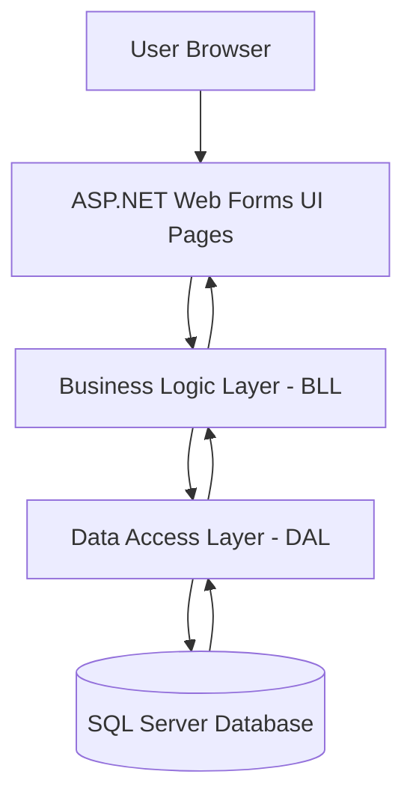
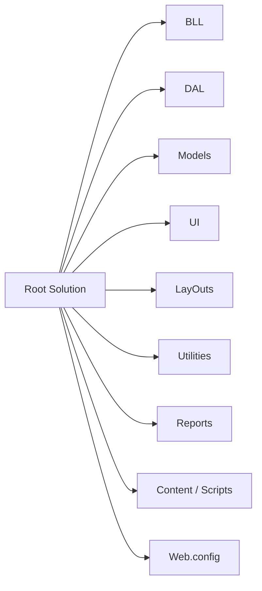
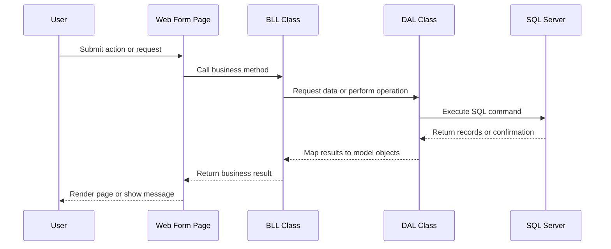

# SIMS Akura

SIMS Akura is an ASP.NET Web Forms application built on the .NET Framework 4.7.2 for managing inventory, purchases, suppliers, customers, products, stock movement, and account transactions. The system follows a simple layered architecture that separates presentation, business rules, and data access responsibilities.

## 1. Project Purpose
This application is designed to support day-to-day business operations such as:
- Product, category, unit, supplier, and customer management
- Purchase entry and invoice tracking
- Stock monitoring and stock adjustments
- Account transaction handling
- Audit trail and reporting support

It is a practical business management solution for small to medium-scale operations that need a web-based workflow with SQL Server-backed data storage.

## 2. Architecture Overview
The project is organized using a classic three-layer approach:

### Presentation Layer
- UI/ contains ASP.NET Web Forms pages and user-facing components.
- LayOuts/ contains shared master pages and layout structure.
- Global.asax and Global.asax.cs handle application-level startup and events.

### Business Logic Layer
- BLL/ contains service-style classes such as ProductBLL, PurchaseBLL, StockBLL, and AccountBLL.
- These classes validate input, orchestrate business rules, and call the data layer.

### Data Access Layer
- DAL/ contains classes such as ProductDAL, StockDAL, PurchaseDAL, SupplierDAL, and CustomerDAL.
- These classes execute SQL commands against the database using SqlConnection and SqlCommand.

### Model Layer
- Models/ contains entity models and view models used across the application.
- Examples include Product, PurchaseInvoice, StockView, Supplier, Customer, and Unit.

### Architecture Diagram


### Design Patterns Used
- Layered Architecture: clear separation of UI, business logic, and data access
- Repository-like Data Access Classes: DAL classes encapsulate SQL operations
- Model-Driven Design: business entities are represented in the Models folder
- Page-Based UI Pattern: Web Forms pages interact directly with business services

## 3. Repository Structure
- BLL/ - business logic classes
- DAL/ - database access logic
- Models/ - domain entities and data transfer objects
- UI/ - web pages and forms
- LayOuts/ - master pages and shared layout
- Utilities/ - helper classes such as database connection helpers
- Reports/ - report-related files and assets
- Content/ and Scripts/ - CSS, JavaScript, and frontend assets
- Web.config - main configuration and connection string settings
- SIMS_Akura.sln - Visual Studio solution file

### Repository Structure Diagram


## 4. Data Flow and Request Lifecycle
A typical request moves through the system in the following sequence:



## 5. Database and Connection Design
The application uses SQL Server through the connection string defined in Web.config.

### Connection Configuration
The application currently connects to a SQL Server database using the connection string name:
- db_sims_akura

The connection string points to a database instance and catalog named db_sims_akura, and the project uses integrated security.

### Data Access Pattern
The DAL classes follow a direct ADO.NET pattern:
1. Open a SqlConnection using a shared database helper.
2. Build a SQL query or stored procedure-style command.
3. Map the returned rows into model objects.
4. Return the results to the BLL layer.

A good example is StockDAL, which reads stock overview data, batch information, stock adjustments, and valuation summaries directly from SQL tables such as Products, Categories, Units, StockBatches, and StockMovements.

## 6. Core Modules
### Inventory Management
- Product master data
- Category and unit definitions
- Stock summary and stock adjustment operations

### Purchasing
- Purchase invoice creation
- Purchase item tracking
- Supplier-based order and transaction history

### Customers and Accounts
- Customer records
- Account transaction processing
- Balance and financial-related operations

## 7. Git and Collaboration Setup
### Recommended Git Workflow
1. Clone the repository locally.
2. Create a feature branch for every change.
3. Commit often with clear messages.
4. Push the branch and open a pull request for review.

### Useful Git Commands
```bash
git clone <repository-url>
git checkout -b feature/my-change
git status
git add .
git commit -m "Add feature"
git push origin feature/my-change
```

### Suggested Branch Naming
- feature/short-description
- bugfix/issue-name
- hotfix/urgent-fix

## 8. Technology Stack
- ASP.NET Web Forms
- .NET Framework 4.7.2
- ADO.NET with SqlClient
- SQL Server
- Bootstrap and custom CSS/JavaScript assets

## 9. Setup Instructions
1. Install Visual Studio with the ASP.NET Web Development workload.
2. Open the solution file: SIMS_Akura.sln
3. Restore NuGet packages if needed.
4. Ensure the SQL Server instance is available and the database exists.
5. Update the connection string in Web.config if your database server or catalog name differs.
6. Build the solution and run it with IIS Express.

## 10. Development Notes
- The project uses a straightforward, manual data-access approach rather than EF Core or modern ORM frameworks.
- Business rules are kept in the BLL layer, while the DAL layer remains focused on SQL execution.
- Sensitive configuration values should not be committed to source control.
- Local development environments may require adjusting the SQL Server instance name and authentication settings.

## 11. Licensing
This project is currently provided as a development and educational codebase. If you are using it in a production environment, please confirm the licensing terms with the original author or project owner before deployment.

If you plan to share or redistribute the project, include the original copyright and license information in the distributed package.

## 12. Summary
SIMS Akura is a web-based enterprise-style inventory and transaction management system built with classic ASP.NET Web Forms and ADO.NET. Its structure is intentionally simple and easy to follow, making it suitable for learning, maintenance, and extension.
